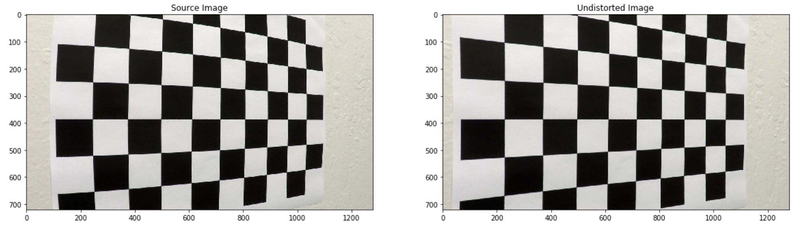

# Advanced Lane Finding [](http://www.udacity.com/drive)

Our goal in this project is to write a software pipeline to identify the lane boundaries.

## Pipeline

### Camera Calibration & Distortion Correction
Briefly state how you computed the camera matrix and distortion coefficients.

```python
# Camera Calibration
objp = np.zeros((6*9,3), np.float32)
objp[:,:2] = np.mgrid[0:9, 0:6].T.reshape(-1,2)

objpoints = [] #3D
imgpoints = [] #2D

images = glob.glob('camera_cal/calibration*.jpg')
        
for path in images:
    img = cv2.imread(path)
    gray = cv2.cvtColor(img, cv2.COLOR_BGR2GRAY)

    # Find the chessboard corners
    ret, corners = cv2.findChessboardCorners(gray, (9,6), None)

    # If found, add object points, image points
    if ret == True:
        objpoints.append(objp)
        imgpoints.append(corners)
```
<p align="center">
  
</p>

<p align="center">
  
</p>

### Perspective Transform
Describe how (and identify where in your code) you performed a perspective transform

```python
src = np.float32(
        [[730,450], # right top
         [1050,650], # right bottom
         [330,650], # left bottom
         [600,450]]) # left top
    
dst = np.float32(
        [[1200,0], # right top
         [1200,700], # right bottom
         [200,700], # left bottom
         [200,0]]) # left top 

M = cv2.getPerspectiveTransform(src,dst)
warped = cv2.warpPerspective(img, M, img_size, flags= cv2.INTER_LINEAR)
```
<p align="center">
  
</p>

### Color Transforming
Describe how (and identify where in your code) you used color transforms, gradients or other methods to create a thresholded binary image. 

```python
l_channel = cv2.cvtColor(img, cv2.COLOR_RGB2LUV)[:,:,0]
b_channel = cv2.cvtColor(img, cv2.COLOR_RGB2Lab)[:,:,2]

b_min = 150
b_max = 200
b_binary = np.zeros_like(b_channel)
b_binary[(b_channel >= b_min) & (b_channel <= b_max)] = 1

l_min = 200
l_max = 255
l_binary = np.zeros_like(l_channel)
l_binary[(l_channel >= l_min) & (l_channel <= l_max)] = 1
    
gray = cv2.cvtColor(img, cv2.COLOR_RGB2GRAY)
    
# Sobel x
sobelx = cv2.Sobel(gray, cv2.CV_64F, 1, 0) # Take the derivative in x
abs_sobelx = np.absolute(sobelx) # Absolute x derivative to accentuate lines away from horizontal
scaled_sobel = np.uint8(255*abs_sobelx/np.max(abs_sobelx))

# Threshold x gradient
thresh_min = 40
thresh_max = 100
sxbinary = np.zeros_like(scaled_sobel)
sxbinary[(scaled_sobel >= thresh_min) & (scaled_sobel <= thresh_max)] = 1

combined_binary = np.zeros_like(s_binary)
combined_binary[(sxbinary == 1) | (l_binary == 1) | (b_binary == 1)] = 1
```
<p align="center">
  
</p>

### Lane Line Finding

#### Fitting Polynomial
Describe how (and identify where in your code) you identified lane-line pixels and fit their positions with a polynomial?

```python
# Concatenate the arrays of indices
left_lane_inds = np.concatenate(left_lane_inds)
right_lane_inds = np.concatenate(right_lane_inds)
        
# Extract left and right line pixel positions
leftx = nonzerox[left_lane_inds]
lefty = nonzeroy[left_lane_inds] 
rightx = nonzerox[right_lane_inds]
righty = nonzeroy[right_lane_inds] 

# Fit a second order polynomial to each
left_fit = np.polyfit(lefty, leftx, 2)
right_fit = np.polyfit(righty, rightx, 2)
```

#### Measuring Curvature
Describe how (and identify where in your code) you calculated the radius of curvature of the lane and the position of the vehicle with respect to center.

```python
left_curverad = ((1 + (2*left_fit_cr[0]*y_eval*ym_per_pix + left_fit_cr[1])**2)**1.5) / np.absolute(2*left_fit_cr[0])
right_curverad = ((1 + (2*right_fit_cr[0]*y_eval*ym_per_pix + right_fit_cr[1])**2)**1.5) / np.absolute(2*right_fit_cr[0])

curvature = (left_curverad + right_curverad)/2

xm_per_pix = 3.7/700 # meters per pixel in x dimension

# Assuming center of camera is the car's center
car_center = img.shape[1]/2
   
# Center between lane lines
center_lane = np.mean(left_fitx+right_fitx)/2
    
# Compute the diffrenece between car center and lane lines center
center = (car_center - center_lane)*xm_per_pix
```
<p align="center">
  
  <br/><br/>
  Advanced Lane Finding (<a target="_blank" href="https://youtu.be/WPRGi-QqG3A">Full Video</a>)
</p>

## Discussion
In image thresholding, we encouraged to use S channel in HLS. Instead, I used another channels like L in LUV and b in Lab in addition to the gradient. Using these channels improve lane finding, unlike using S channel from HLS which create noisy images.

## Future Improvments
1. Improve image thresholding to generalize on challenging tracks.
2. Improve Sliding Window to search on specific areas.
3. Use Machine Learning for identifying lane lines.
