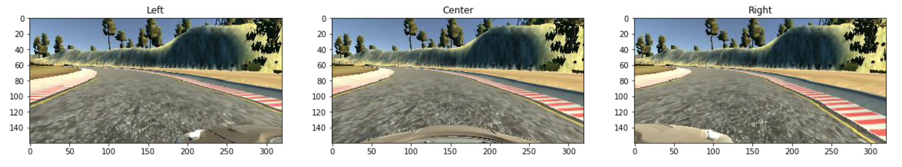
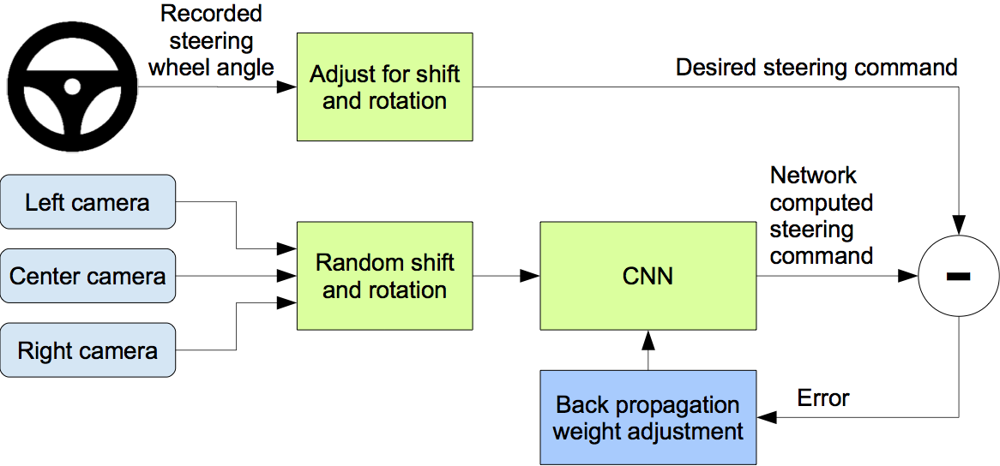

# Behaviorial Cloning [](http://www.udacity.com/drive)

In this project, I Built and trained a convolutional neural network for end-to-end driving in a simulator, using TensorFlow and Keras. I used optimization techniques such as regularization and dropout to generalize the network for driving on multiple tracks.


## Project Structure

| File                         | Description                                                             |
| ---------------------------- | ----------------------------------------------------------------------- |
| `model.py`                   | Convolutional Neural Network Pipeline                                   |
| `model.h5`                   | Trained model to predict steering wheel angle - Generated by `model.py` |
| `drive.py`                   | Drive the car using `model.h5` to predict the steering wheel angle      |

## Dataset Structure
In simulator, there are 3 cameras attached to the car. These are the images taken by each camera:

| Postion | Size | Dimension | Color |
|---------|------|-----------|-------|
|  Left   | ~16K |  160x320  |  RGB  |
|  Center | ~16K |  160x320  |  RGB  |
|  Right  | ~16K |  160x320  |  RGB  |
|  **Total** | **~50k** |  **160x320**  |  **RGB**  |

<p align="center">
  
</p>

> It takes about 30min of driving around the track, to get this amount of data.

## Training Strategy

### Augmentation
To get more data and get rid of the bias in turning left because almost all the turns during the driving session are turning to the left, we flipped the images verticaly then multiply the each sterring wheel angle for flipped images by `-1`

```python

measurments = read_csv('data/driving_log.csv', usecols=[3]).values
Center = measurments
Left = measurments 
Right = measurments
measurments = np.concatenate((Center, Left, Right, -Center, -Left, -Right), axis=0)

```

> This operation produce ~150k in total (Original and Filpped).

### Stay Between Lane Lines

```python

measurments = read_csv('data/driving_log.csv', usecols=[3]).values
Center = measurments
Left =  measurments + 0.2
Right = measurments - 0.2
measurments = np.concatenate((Center, Left, Right, -Center, -Left, -Right), axis=0)

```

### Overfitting
I used **Dropout** to prevent the model from overfitting and generalize better to other tracks and driving in reverse.

## How Camera and Steering Wheel Work
Each image taken has its own steering wheel angle which will act as a result of the neural network. This image demonstrates the process.

<p align="center">
  
  <br/><br/>
  End to End Learning for Self-Driving Cars (<a target="_blank" href="https://arxiv.org/abs/1604.07316">Paper</a>)
</p>

## Model Architecture

<p align="center">
  
  <br/><br/>
  End to End Learning for Self-Driving Cars (<a target="_blank" href="https://arxiv.org/abs/1604.07316">Paper</a>)
</p>

## Results

<p align="center">
  
  <br/><br/>
  <a target="_blank" href="https://youtu.be/08jBeBCmbLE">Fully Autonomous Driving Video</a>
</p>

## Future Improvements

* Train on Second Track to generalize better
* Try [comma.ai](http://comma.ai) Architecture
