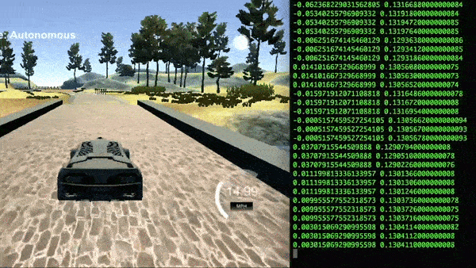

# Behaviorial Cloning

## Project Structure

| File                         | Description                                                             |
| ---------------------------- | ----------------------------------------------------------------------- |
| `model.py`                   | Convolutional Neural Network Pipeline to generate `Model.h5`            |
| `model.h5`                   | Trained model to predict steering wheel angle - Generated by `model.py` |
| `drive.py`                   | Drive the car using `model.h5` to predict the steering wheel angle      |

## Training Strategy

### Dataset
In simulator, there are 3 cameras atached to the car. These are the images taken by each camera:

| Postion | Size | Dimension | Color |
|---------|------|-----------|-------|
|  Left   | ~16K |  160x320  |  RGB  |
|  Center | ~16K |  160x320  |  RGB  |
|  Right  | ~16K |  160x320  |  RGB  |
|  Total  | ~50k |  160x320  |  RGB  |

* To get this amount of data, I drove around 

### Augmentation

### 

## Model Architecture
[NVIDIA End to End Learning for Self-Driving Cars Paper](https://arxiv.org/abs/1604.07316)

## Results

  
   
  <a target="_blank" href="https://youtu.be/08jBeBCmbLE">Fully Autonomous Driving Video</a>

