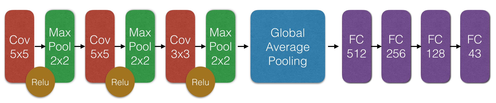
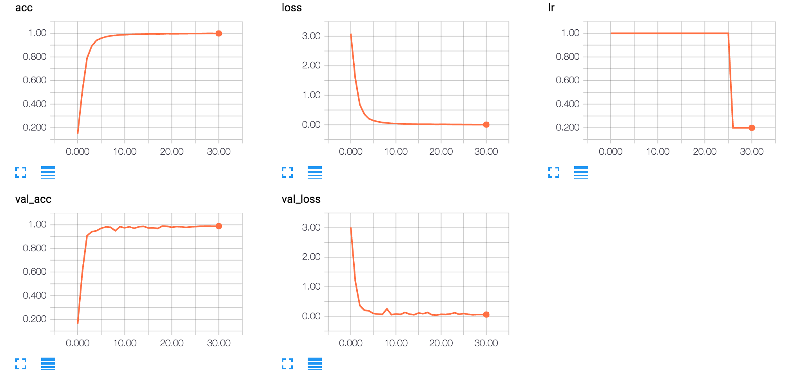

# Traffic Sign Recognition Program
[](http://www.udacity.com/drive)

Our main goal in this project is to classify [German Traffic Sign Dataset](http://benchmark.ini.rub.de/?section=gtsrb&subsection=dataset) by using Convolutional Neural Network (CNN). This project is a part of Udacity's Self-Driving Car Nanodegree Projects in Term 1.

## Dataset

```
    Type         Amount     Size     Color
    
    Training     34,799    32x32      RGB

    Validation   4,410     32x32      RGB

    Testing      12,630    32x32      RGB
```

## Preprocessing

Here are some preprocessing techniques that have proven to work on this dataset:

* **Pixel Normalization**. We normalized the image to a range `[0,1]` instead of `[0-255]`.

* **Pixel Mean Centering**. We subtract 0.5 from each pixel after applying the pixel normalization.

## Augmentation

When we augment all the images at once, the accuracy did not improve that much. I think we should augment only the classes that we do not have much data about it. These are augmentation techniques used: 

* **Rotating**

* **Shifting**

* **Zooming**

> **Note**: Augmentation is there in code as a function. It needs some modification as we mentioned above.

## Model 

### Architecture

I started first with LeNet and I tried to play around with the hyperparameters and I got around 89% as validation accuracy. Then, after reading some papers about available CNN I tried to implement [SqueezeNet](https://arxiv.org/pdf/1602.07360.pdf) which they claim to be as accurate as AlexNet but 50X faster. I got validation accuracy about 90%, so I decided to build my own CNN. I build my CNN with 3 Convolutional layers and 3 Fully Connected layers, I got validation accuracy about **99% without even preprocess or augmenting my dataset**, I called my network, **YazNet** ;)

<p align="center">
  
</p>

```
    Convolution (128, 5x5)
    Activation: Relu
    Max Pooling (2x2)
    Batch Normalization
    
    Convolution (256, 5x5)
    Activation: Relu
    Max Pooling (2x2)
    Batch Normalization
    
    Convolution (512, 3x3)
    Activation: Relu
    Max Pooling (2x2)
    Batch Normalization

    Global Average Pooling
    
    FC 512
    Activation: Relu
    Dropout
    
    FC 256
    Activation: Relu
    Dropout
    
    FC 128
    Activation: Relu
    Dropout
    
    FC 43
    Activation: Sigmoid
```

### Regularization

* **Dropout**. Prevent the model from overfitting.

* **Reduce Learning Rate**. Reduce learning rate when a metric has stopped improving.

* **Early Stopping**. Stop model from continues with the learning process if there is no improvement in the validation accuracy.

## Training

I used Adam, Adagrad, Adadelta, SGD and RMSprop as optimizers. Adadelta has proven to provide the best accuracy among these optimizers. [Adadelta](http://sebastianruder.com/optimizing-gradient-descent/index.html#adadelta) is an extension of Adagrad that seeks to reduce it's aggressive, monotonically decreasing learning rate. Instead of accumulating all past squared gradients, Adadelta restricts the window of accumulated past gradients to some fixed size w.

I tried to inject layers and remove some and mix them till I got **YazNet** which provide the highest accuracy on plain augmented images. From choosing the filter size for each layer till reaching batch size for training the model, tuning hyperparameter plays a great role in increasing the accuracy of my model.


<p align="center">
  
</p>


## Result

To get a clue of how well my model is performing we used about 30 new images and let the model predict them, we got 91% as accuracy compared to 98% on the test set. It is not a fair comparison because test images consist of 12,630 and 35 captured images. so, the accuracy does not prove anything yet. When my model misclassify a sign or it is uncertain about its predictions I look back to the data and find out that my model misclassify a sign when there is no enough data about that class and on the contrary its certainty increased when data of that class increased so when it learns more and more it makes better prediction on unseen images.

## Future Improvements

* **Augmentation for Classes with Less Data**