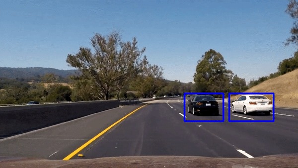

# Vehicle Detection and Tracking [](http://www.udacity.com/drive)

Our goal in this project is to write a software pipeline to identify vehicles in a video from a front-facing camera on a car. 

## Dataset
Datasets are comprised of images taken from the [GTI](http://www.gti.ssr.upm.es/data/Vehicle_database.html) vehicle image database

|    Type      | Amount |  Size | Color |
|--------------|--------|-------|-------|
| Vehicles     | ~8,790 | 64x64 |  RGB  |
| Non-Vehicles | ~8,970 | 64x64 |  RGB  |

## Pipeline

### Histogram of Oriented Gradients (HOG)
We used [HOG](http://lear.inrialpes.fr/people/triggs/pubs/Dalal-cvpr05.pdf) which is an effective approach for object detection. We extracted hog features using Scikit library. We converted `RGB` color space to `YCrCb` which gives the best accuracy on test images. After experimenting with HOG parameters, we have chosen `orientations= 9, pixels_per_cell= (8, 8), cells_per_block= (2, 2)` as it tend to be very effective on `64x64` images and increasing values like orientations will increase the features vector and did not improve the model accuracy.
```python
from skimage.feature import hog

image = cv2.cvtColor(image, cv2.COLOR_RGB2YCrCb)

ch1 = feature_image[:,:,0]
ch2 = feature_image[:,:,1]
ch3 = feature_image[:,:,2]

hog1 = hog(ch1, orientations=9, pixels_per_cell=(8, 8), cells_per_block=(2, 2))
hog2 = hog(ch2, orientations=9, pixels_per_cell=(8, 8), cells_per_block=(2, 2))
hog3 = hog(ch3, orientations=9, pixels_per_cell=(8, 8), cells_per_block=(2, 2))

hog_features = np.hstack((hog1, hog2, hog3))
```
<p align="center">
  
  <br/>
  <a href="http://www.udacity.com/drive">SDCND</a>
</p>

### The Classifier

### Sliding Window Search

```python

```
<p align="center">
  
</p>

### False Positives and Overlapping

```python

```
<p align="center">
  
</p>

## Result

<p align="center">
  
  <br/><br/>
  Vehicle Detection and Tracking (<a target="_blank" href="https://youtu.be/TAdXKc_fqCE">Full Video</a>)
</p>

## Discussion


## Future Improvments
* 
