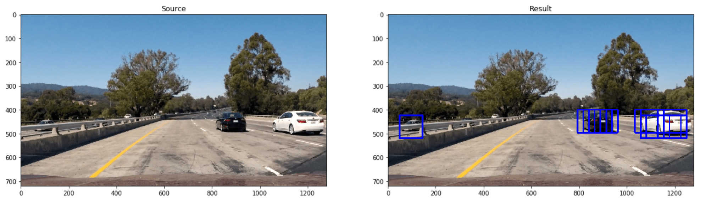

# Vehicle Detection and Tracking [](http://www.udacity.com/drive)

Our goal in this project is to write a software pipeline to identify vehicles in a video from a front-facing camera on a car. 

## Dataset
Datasets are comprised of images taken from the [GTI](http://www.gti.ssr.upm.es/data/Vehicle_database.html) vehicle image database.

|    Type      | Amount |  Size | Color |
|--------------|--------|-------|-------|
| Vehicles     | ~8,790 | 64x64 |  RGB  |
| Non-Vehicles | ~8,970 | 64x64 |  RGB  |

## Pipeline

### Histogram of Oriented Gradients (HOG)
[HOG](http://lear.inrialpes.fr/people/triggs/pubs/Dalal-cvpr05.pdf) has been used as an effective approach for object detection. HOG features were extracted using Scikit library. We converted `RGB` color space to `YCrCb` which gives the best accuracy on test images. After experimenting with HOG parameters, these parameters have chosen `orientations= 9, pixels_per_cell= (8, 8), cells_per_block= (2, 2)` as it tend to be very effective on `64x64` images and increasing values like orientations will increase the features vector and did not improve the model accuracy.
```python
from skimage.feature import hog

image = cv2.cvtColor(image, cv2.COLOR_RGB2YCrCb)

ch1 = feature_image[:,:,0]
ch2 = feature_image[:,:,1]
ch3 = feature_image[:,:,2]

hog1 = hog(ch1, orientations=9, pixels_per_cell=(8, 8), cells_per_block=(2, 2))
hog2 = hog(ch2, orientations=9, pixels_per_cell=(8, 8), cells_per_block=(2, 2))
hog3 = hog(ch3, orientations=9, pixels_per_cell=(8, 8), cells_per_block=(2, 2))

hog_features = np.hstack((hog1, hog2, hog3))
```
<p align="center">
  
  <br/>
  <a href="http://www.udacity.com/drive">SDCND</a>
</p>

### The Classifier
SVM used as a classifier to detect vehicles from non-vehicles, and the accuracy was 99.06% on test samples which represent 20% of the dataset. Matplotlib already imported `png` images as scaled from `0-1` so no need for dividing images by 255. Features used to classify images was spatial color, color histogram and HOG features.
```python
from sklearn.model_selection import train_test_split
from sklearn.preprocessing import StandardScaler
from sklearn.svm import LinearSVC
import glob

# Read in our vehicles and non-vehicles
non_vehicles = glob.glob('Dataset/non-vehicles/*/*.png')
vehicles = glob.glob('Dataset/vehicles/*/*.png')

X = []

for path in np.append(vehicles, non_vehicles):
    image = mpimg.imread(path)
    X.append(extract_features(image))
X = np.array(X).astype(np.float64)
Y = np.hstack((np.ones(len(vehicles)), np.zeros(len(non_vehicles))))
# Fit a per-column scaler
X_scaler = StandardScaler().fit(X)
# Apply the scaler to X
scaled_X = X_scaler.transform(X)

rand_state = np.random.randint(0, 100)
X_train, X_test, y_train, y_test = train_test_split(
    scaled_X, Y, test_size=0.2, random_state=rand_state)

svc = LinearSVC()
svc.fit(X_train, y_train)
print('Test Accuracy of SVC = ', round(svc.score(X_test, y_test), 4))
```

### Sliding Window Search

```python
img_tosearch = img[ystart:ystop,:,:]

# Define blocks and steps as above
nxblocks = (ch1.shape[1] // pix_per_cell) - cell_per_block + 1
nyblocks = (ch1.shape[0] // pix_per_cell) - cell_per_block + 1 
nfeat_per_block = orient*cell_per_block**2
    
# 64 was the orginal sampling rate, with 8 cells and 8 pix per cell
window = 64
nblocks_per_window = (window // pix_per_cell) - cell_per_block + 1
cells_per_step = 2  # Instead of overlap, define how many cells to step
nxsteps = (nxblocks - nblocks_per_window) // cells_per_step
nysteps = (nyblocks - nblocks_per_window) // cells_per_step

for xb in range(nxsteps):
        for yb in range(nysteps):
            ypos = yb*cells_per_step
            xpos = xb*cells_per_step
	    xleft = xpos*pix_per_cell
            ytop = ypos*pix_per_cell
	    
            # Extract Features and Predict #
 	    
            if prediction is True:
                xbox_left = np.int(xleft*scale)
                ytop_draw = np.int(ytop*scale)
                win_draw = np.int(window*scale) 	
  	        box_list.append(((xbox_left, ytop_draw+ystart),
			(xbox_left+win_draw,ytop_draw+win_draw+ystart)))  
```
<p align="center">
  
</p>

<p align="center">
  
</p>

## False Positives and Overlapping
Heatmap was used to overcome the false positives and overlapping issue. As boxes as overlapped in certain positions within the image, its heat will increase, mostly vehicle is detected.
```python
from scipy.ndimage.measurements import label

def add_heat(heatmap, bbox_list):
    # Iterate through list of bboxes
    for box in bbox_list:
        # Add += 1 for all pixels inside each bbox
        heatmap[box[0][1]:box[1][1], box[0][0]:box[1][0]] += 1
    # Return updated heatmap
    return heatmap

def apply_threshold(heatmap, threshold):
    # Zero out pixels below the threshold
    heatmap[heatmap <= threshold] = 0
    # Return thresholded map
    return heatmap

def draw_labeled_bboxes(img, labels):
    # Iterate through all detected cars
    for car_number in range(1, labels[1]+1):
        # Find pixels with each car_number label value
        nonzero = (labels[0] == car_number).nonzero()
        # Identify x and y values of those pixels
        nonzeroy = np.array(nonzero[0])
        nonzerox = np.array(nonzero[1])
        # Define a bounding box based on min/max x and y
        bbox = ((np.min(nonzerox), np.min(nonzeroy)), (np.max(nonzerox), np.max(nonzeroy)))
        # Draw the box on the image
        cv2.rectangle(img, bbox[0], bbox[1], (0,0,255), 6)
    # Return the image
    return img
```
<p align="center">
  
</p>

## Result

<p align="center">
  
  <br/><br/>
  Vehicle Detection and Tracking (<a target="_blank" href="https://youtu.be/TAdXKc_fqCE">Full Video</a>)
</p>

## Discussion
When importing `png` images using Matplotlib, I scaled it by dividing images by 255 which result in bad object detection because classifier trained on [0-1]/255 and images wanted to be predicted was `jpg` which was [0-255]/255. So, this issue fixed by not scaling imported `png` images as it's already scaled.

## Future Improvments
* Using [Single Shot MultiBox Detector](https://arxiv.org/abs/1512.02325) (state-of-the-art for object detection)
* Vectorize Function to Speed Up the Object Detection (Detect in < 1sec)
